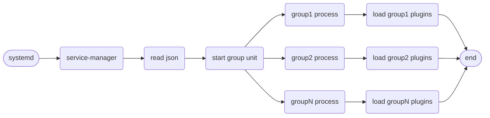
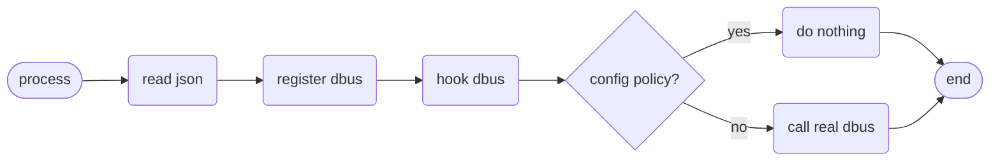
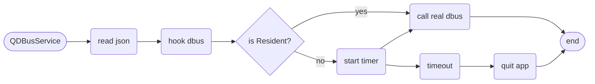

# {{ $frontmatter.title }}

本篇文章将介绍 Deepin 后端服务框架如何使用，主要实现两个部分：一个接口，一个配置。

## 功能和流程

### 核心功能

- 插件服务，把服务以一个插件方式加载运行
- dbus 接口私有化（接口隐藏、接口白名单）
- dbus 服务的按需启动
- 独立应用的 dbus 接口私有化 sdk

### 加载流程

#### 常驻服务插件加载流程



1. 如图所示，deepin-service-manager 由 systemd 服务拉起来；
2. service 起来后读取所有的 json 配置文件，根据配置文件进行分组；
3. 按照分好的组通过 systemd 启动子进程实例，并传入组名；
4. 子进程启动，按照传入的组名进行过滤，注册该组的服务，并且根据配置文件（Resident、OnDemand）决定是否立即加载 so 插件。

#### 权限管理流程



1. 进程起来后会到特定目录读取 json 配置
2. 注册 dbus 服务时，会对 dbus 进行 hook 操作
3. 当 dbus 接口被调用时，hook 方法会进行拦截，此时根据配置文件中的 policy 配置决定是否继续调用真正的接口

#### 独立应用开发流程



1. 独立应用需继承 QDBusService 类
2. 初始化时需指定 json 配置文件，QDBusService 会进行 hook dbus操作
3. 当配置中指定了按需启动，则启动定时器，超时即退出进程

## 插件开发

### 提供配置文件

```json
{
  "name": "org.deepin.service.demo", // [必选]dbus name，框架中会注册该name
  "libPath": "demo.so", // [必选]插件so名称
  "group": "core", // [可选]插件按进程分组，默认分组为 core
  "pluginType": "qt", // [可选]插件类型，暂时只有 qt 和 sd 两种，默认为 qt
  "policyVersion": "1.0", // [可选]配置文件版本，预留配置，无实际用途
  "policyStartType": "Resident", // [可选]启动方式，Resident（常驻）、OnDemand（按需启动）。默认Resident。
  "dependencies": [], // [可选]若依赖其他服务，可将服务名填在此处，在依赖启动之前不会启动此服务
  "startDelay": 0, // [可选]若需要延时启动，可将延时时间填在此处，单位为秒
}
```

:::tip 提示
配置文件中必选字段为必须要填写字段，否则插件无法正常启动，可选字段可视情况选择填写即可！
:::

:::warning 警告
插件并不会闲时退出，在插件配置中，`policyStartType`只影响该插件是否在服务启动时立即加载，并不会进行退出操作。若要实现闲时退出功能，需使用`SDK`方式编写服务，参考[这里](#独立应用开发)。
:::

配置文件安装路径规则：

**system**:

```shell
/usr/share/deepin-service-manager/system/demo.json
```

**session**:

```shell
/usr/share/deepin-service-manager/user/demo.json
```

### 实现入口函数

1. qdbus

    ```cpp
    #include <QDBusConnection>
    #include "service.h" // 实现的dbusobject，基本支持qdbus原规则

    static Service *service = nullptr;

    // name:dbus name,配置文件中的"name"，
    // data:自定义数据
    extern "C" int DSMRegister(const char *name, void *data)
    {
        (void)data;
        service = new Service();
        QDBusConnection::RegisterOptions opts =
            QDBusConnection::ExportAllSlots | QDBusConnection::ExportAllSignals |
            QDBusConnection::ExportAllProperties;

        QDBusConnection::connectToBus(QDBusConnection::SessionBus, QString(name))
            .registerObject("/org/deepin/services/demo1", service, opts);
        return 0;
    }

    // 插件卸载时，若需要释放资源请在此实现
    extern "C" int DSMUnRegister(const char *name, void *data)
    {
        (void)name;
        (void)data;
        service->deleteLater();
        service = nullptr;
        return 0;
    }
    ```

2. sdbus

    ```c
    #include "service.h"

    extern "C" int DSMRegister(const char *name, void *data)
    {
        (void)name;
        if (!data) {
            return -1;
        }
        sd_bus *bus = (sd_bus *)data;
        sd_bus_slot *slot = NULL;
        if (sd_bus_add_object_vtable(bus,
                                    &slot,
                                    "/org/deepin/service/sdbus/demo1",
                                    "org.deepin.service.sdbus.demo1",
                                    calculator_vtable,
                                    NULL) < 0) {
            return -1;
        }
        return 0;
    }

    extern "C" int DSMUnRegister(const char *name, void *data)
    {
        (void)name;
        (void)data;
        return 0;
    }
    ```

**实现的 so 安装路径为 `${CMAKE_INSTALL_LIBDIR}/deepin-service-manager/`**

:::tip 提示
不同平台的 lib 路径可能不一样，推荐使用[GNUInstallDirs](https://cmake.org/cmake/help/latest/module/GNUInstallDirs.html?highlight=gnuinstalldirs)
:::

## 独立应用开发

### 提供配置文件

```json
{
  "name": "org.deepin.service.demo", // [必选]dbus name，框架中会注册该name
  "policyVersion": "1.0", // [可选]配置文件版本，预留配置，无实际用途
  "policyStartType": "Resident", // [可选]启动方式，Resident（常驻）、OnDemand（按需启动），默认Resident。若设置 OnDaemand，则需要设置 idleTime 字段！
  "idleTime": 10 // [可选]若服务是按需启动，则可以设置闲时时间，超时则会退出当前进程
}
```

:::tip 提示
独立应用的配置文件与插件的配置文件很多地方不一样，插件中的很多配置，在独立应用中是不生效的！
:::

配置文件安装路径规则：

```shell
/usr/share/deepin-service-manager/other/demo.json
```

### 主要实现

:::info QDBusService
该类实现了 dbus 权限管控和闲时退出功能，使用该类非常自由：

    - 可以继承该类
    - 可以单独创建该类实例

1. DBus Interface 类继承该类：

    ```cpp
    class ServiceInterface : public QDBusService
    {
        Q_OBJECT
        Q_CLASSINFO("D-Bus Interface", ServiceInterfaceStr);

    public:
        explicit ServiceInterface(QObject *parent = nullptr);
        void init(const QDBusConnection::BusType &type) {
            initPolicy(type, QString(SERVICE_CONFIG_DIR) + "other/demo.json");
        }
    };

    ```

    然后直接创建该类实例，并用该类进行 DBus 注册即可，如：

    ```cpp
    if (!connection.registerObject(ServiceInterfacePath,
                                   serviceInterfaceInstance,
                                   QDBusConnection::ExportScriptableContents
                                           | QDBusConnection::ExportAllProperties)) {
        qWarning() << "[ServiceManager]failed to register dbus object: "
                   << connection.lastError().message();
    }
    ```

2. 使用 DBus Adaptor 方式进行注册：

    ```cpp
    class Service : public QDBusService, protected QDBusContext
    {
        Q_OBJECT
    public:
        explicit Service(QObject *parent = nullptr) {
                initPolicy(QDBusConnection::SessionBus,
                    QString(SERVICE_CONFIG_DIR) + "other/demo.json");
        }

        Q_PROPERTY(QString msg READ Msg WRITE SetMsg NOTIFY MsgChanged)
        QString Msg();
        void SetMsg(QString value);

    Q_SIGNALS:
        // xml - signal
        void MsgChanged(const QString &msg);

    public Q_SLOTS:
        // xml - method
        QString Hello();

    private:
        QString m_msg;
    };

    ```

    然后使用 adaptor 进行注册：

    ```cpp
    Service s;
    DemoAdaptor adp(&s);
    // 从QDBusService对象拿到 QDBusConnection 防止注册对象不一致，导致无法正常管理权限
    QDBusConnection connection = s.qDbusConnection();
    if (!connection.registerObject("/org/deepin/service/demo", &s)) {
        qWarning() << "failed to register dbus object" << connection.lastError().message();
    }
    ```

3. 单独使用该类：

    ```cpp
    QDBusService service;
    service.initPolicy(QDBusConnection::SessionBus,
        QString(SERVICE_CONFIG_DIR) + "other/demo.json");
    ```

    可以将这段代码放在任何类里。
:::

:::tip 提示
独立应用若需要按需启动，需要安装 DBus service文件，参考[demo](#附件列表)
:::

### API 说明

```cpp
QDBusService::initPolicy(const QDBusConnection::BusType&, const QString&)
```

初始化配置，需要指定 DBus 类型和配置文件路径。
<br><br>

```cpp
QDBusService::qDbusConnection()
```

获取 QDBusConnection 对象，为保持服务总线在一个对象上，务必不要使用默认的 QDBusConnection，而是从这里获取。
<br><br>

```cpp
QDBusService::lockTimer(bool)
```

是否锁定计时器，若锁定计时器，则在解锁前不会执行闲时退出操作。参数为`true`是锁定，否则解锁。

## 给插件或应用加上权限

在原来的配置文件增加权限规则即可。

```json
{
  "whitelists": [
    // 白名单规则，给下面 policy 做权限规则配置，单独存在无意义
    {
      "name": "w1",
      "process": ["/usr/bin/aaa", "/usr/bin/bbb"]
    },
    {
      "name": "w2",
      "process": ["/usr/bin/aaa", "/usr/bin/ccc", "/usr/bin/python3"]
    },
    {
      "name": "all",
      "description": "No configuration is required, which means no restrictions"
    }
  ],
  "policy": [
    // 若需要权限管控，则应按此配置进行
    {
      "path": "/qdbus/demo1",
      "pathhide": true, // 隐藏该path，但可调用。可选，默认false
      "permission": true, // 开启权限。可选，默认false。注意该功能在 V20 上不可用，V23可正常使用，原因是Qt的DBus实现有问题。
      "subpath": true, // 子path也应用该权限（针对动态生成的子路径）。可选，默认false
      "whitelist": "w1", // 开启权限后，调用上方的白名单规则
      // path->interfaces->methods，权限层级，未指定的下级继承上级的权限配置，指定了的覆盖上级配置
      "interfaces": [
        {
          "interface": "org.deepin.service.demo",
          "whitelist": "w1",
          // "permission":true, // 不填则继承上级PATH的配置
          "methods": [
            {
              "method": "Multiply", // 具体方法的权限管控
              "whitelist": "w2"
            }
          ],
          "properties": [
            {
              "property": "Age",
              "permission": false
            }
          ]
        }
      ]
    },
    {
      "path": "/qdbus/demo2", // 此配置只隐藏路径, 不做权限管控，适合 V20 使用
      "pathhide": true
    }
  ]
}
```

>在原来的配置基础上，加上上面的配置即可加上权限管控功能！

## 查看插件是否生效

将 .so 和 .json 文件放到指定位置后，执行命令：

1. system

    ```bash
    sudo systemctl restart deepin-service-manager.service
    ```

2. session

    ```bash
    systemctl --user restart deepin-service-manager.service
    ```

重启服务后，即可通过 DBus 命令行或 d-feet 工具查看 json 中的 DBus 服务已被启动，服务名即 json 中的`name`字段配置的内容。

在`org.deepin.service.manager`服务中：

- `/manager`路径下可查看当前服务中已启动的所有分组进程
- `/group/<group name>`路径下可查看当前分组中加载的所有插件

## 注意事项

在该服务中，分为主服务与分组服务，主服务启动，会根据配置文件，自动启动分组服务，举个例子：

现有一个插件，json 配置中，`group`字段配置为`app`，那么该插件就属于`app`组，主服务启动时会自动按组名启动插件服务，插件服务的名称为：

```bash
deepin-service-plugin@app.service
```

所以在调试时，只需启动插件服务即可：

```bash
sudo systemctl restart deepin-service-plugin@app.service
```

## 附件列表

| [qt 普通插件 demo](/rc/plugin-qdbus-demo1.tar.gz)   |
|---------------------------------------------------|
| [qt 带权限插件 demo](/rc/plugin-qdbus-demo2.tar.gz) |
| [sd 带权限插件 demo](/rc/plugin-sdbus-demo1.tar.gz) |
| [独立应用 demo](/rc/libqdbusservice-demo.tar.gz)    |

## 更新日志

- 2023/02/22:
  - 新增权限管控流程和独立应用开发流程
  - 新增注意事项，调试技巧可参考注意事项
  - 新增附件列表，实现了常见场景的 demo
  - 优化整体页面说明，分为插件开发、独立应用开发以及如何给插件或应用加上权限管控
- 2023/02/08:
  - 新增依赖配置，配置依赖服务后，在依赖未启动时不会启动本服务
  - 新增延时启动，可配置本服务延时启动
- 2023/02/06:
  - 重命名入口函数 DSMRegisterObject->DSMRegister;
  - 新增卸载函数，用于释放内存：DSMUnRegister;
  - json 配置路径更新：去掉了路径中的`qt-service`和`sd-service`，转而使用 json 文件中的`pluginType`来匹配。
