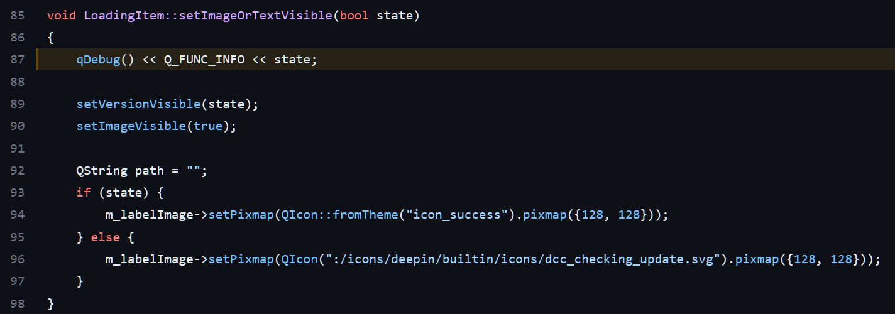
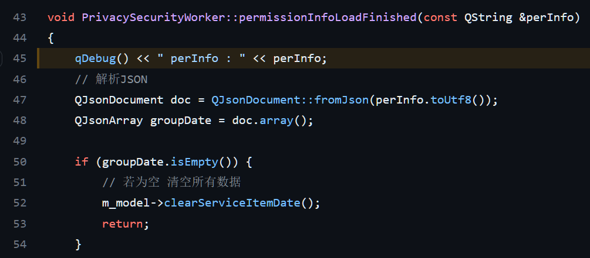
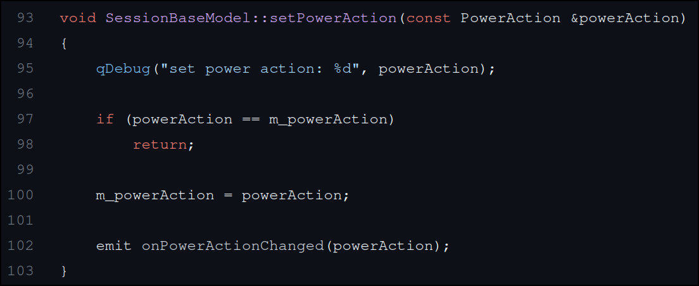
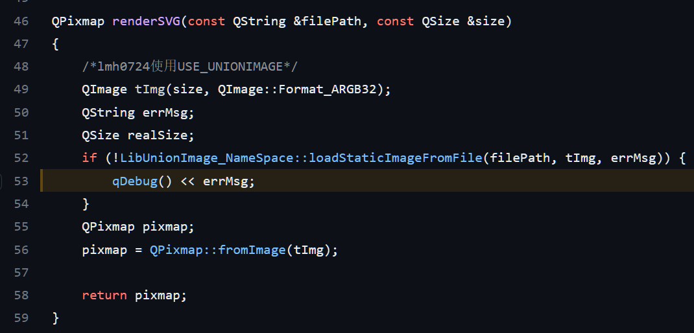
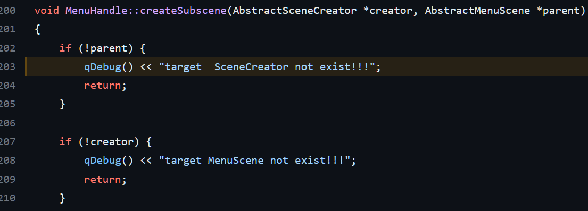
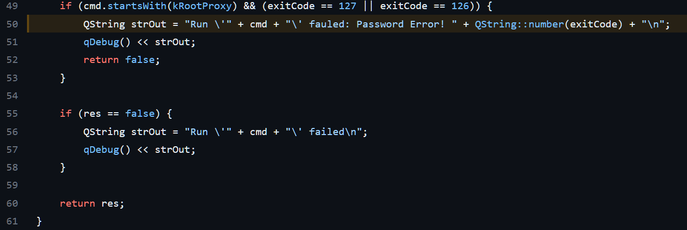
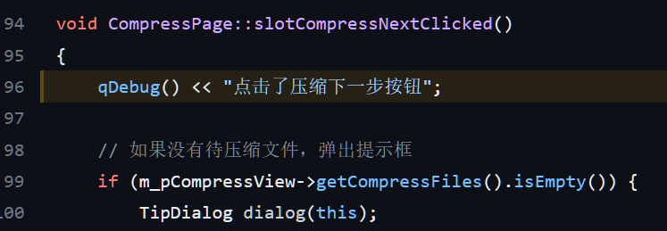
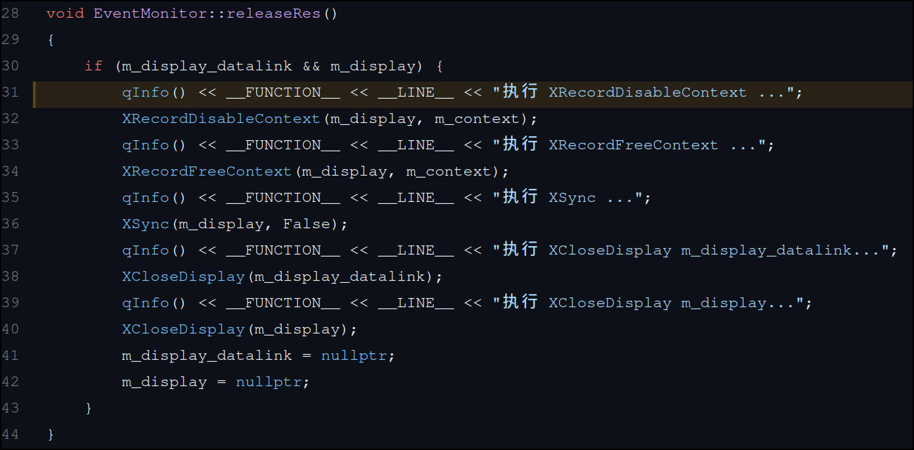
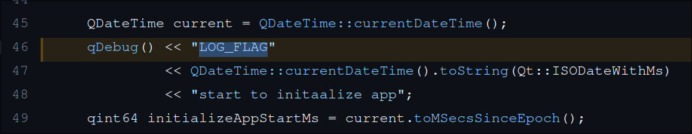

# 正确的使用日志记录

## 为什么需要日志记录

### 故障排除和调试

日志记录可用于帮助诊断问题，例如，如果系统出现错误或崩溃，记录日志可能会提供有关问题的详细信息，使得开发人员可以更快地解决问题。

### 安全性和合规性

日志记录可用于跟踪系统中发生的事件，以帮助确定安全漏洞并提高合规性。例如，在许多行业中，法规要求记录系统中的所有操作，以确保数据安全性。

### 分析和数据挖掘

日志记录还可用于分析和挖掘数据，例如，通过跟踪用户行为和偏好，帮助企业做出更明智的决策。

## 日志记录规则

### 日志记录的格式

日志记录的格式通常包括以下几个部分：

1. 时间戳：记录事件发生的时间，通常使用 ISO 8601 格式或 UNIX 时间戳格式。
2. 日志级别：指示事件的严重程度。
3. 应用程序名称：标识产生日志的应用程序名称，通常使用应用程序的名称或缩写。
4. 进程 ID 和线程 ID：标识产生日志的进程和线程，用于多进程和多线程应用程序中的日志记录。
5. 文件名和行号：记录产生日志的源代码文件和行号，方便开发者进行定位和调试。
6. 函数名：记录产生日志的函数名，方便开发者进行定位和调试。
7. 消息内容：记录事件的详细信息，包括错误信息、异常信息、警告信息、操作信息等。

通常情况下，日志格式可以通过日志记录库或工具的配置文件进行配置和定制。不同的日志记录库或工具可能有不同的格式选项和配置方式。

### 正确使用日志级别

使用正确的日志级别可以帮助我们确定问题的重要性，方便我们在调试和故障排除期间定位和解决问题。以下是一些关于如何使用正确的日志级别的建议：

1. CRITICAL：此级别应该用于指出应用程序的某些关键部分失败，这些失败可能会导致应用程序崩溃或不可用。例如，数据库连接失败或重要的外部服务不可用。
2. ERROR：此级别应该用于指出某些应用程序功能的错误，这些错误需要被解决，但不会导致应用程序崩溃或不可用。例如，请求一个不存在的资源或无效的用户输入。
3. WARNING：此级别应该用于指出某些应用程序功能的非致命性问题，这些问题需要被解决，但不需要立即处理。例如，未能在特定时间内响应请求或某些配置设置不正确。
4. INFO：此级别应该用于记录应用程序的关键事件和状态信息，这些信息可以用于跟踪应用程序的性能和运行状况。例如，启动应用程序或接收到重要的用户请求。
5. DEBUG：此级别应该用于详细记录应用程序的操作，这些操作可以用于调试和故障排除。例如，记录函数调用和变量值。

我们应该根据应用程序的特定需求选择正确的日志级别，并在需要时调整级别以满足新的需求。

> deepin 环境中默认只打印 WARNING 级别以上的日志，不可为了方便将不必要的日志打印成 INFO 或 WARNING 级别！

## 如何写出正确的日志

### 在日志中包含上下文信息

单独一条日志可能无法帮助开发人员准确定位故障信息，此时，需要联系上下文信息以帮助排查。如上一条日志提示正在打开某个文件，下一条日志提示打开文件出错，单独看下一条日志，可能无法看出是哪个文件出错，但联系上一条日志，就可以准确定位是哪个文件打开出错。

### 记录关键流程节点

记录流程的关键节点，方便用于 UT、AT 核心流程检测，维护人员关键流程识别。

### 记录流程异常问题点

在关键流程中，如果数据包含异常信息，则使用 WARNING 以上的级别进行打印。

### 避免敏感信息

在日志中，应该避免敏感信息，敏感信息泄漏可能会导致安全漏洞和隐私泄漏等问题。

### 避免重复的日志信息

在开发中避免重复的日志打印有以下几个建议：

1. 若返回错误值则不应该进行日志打印，如调用一个函数，返回值-1 表示错误 1、-2 表示错误 2，那么就不应该在此处打印日志，而是交给调用者打印。当然，对于程序返回值来说，在返回之前打印一下错误信息是一个良好的习惯。
2. 避免在高频次逻辑里面打印日志，如高频次的循环逻辑，不应打印任何日志，应中断循环后对结果进行打印。

### 不确定不打印原则

如果不确定是否要打印日志，那么就不应该打印该日志。

## Qt 日志记录的最佳实践

### 如何分级、分类

在 Qt 中，日志分级，有两种方式：

- 一种是使用 qDebug() qInfo() qWarning() qCritical() qFatal()
- 另一种是使用 qCDebug() qCInfo() qCWarning() qCCritical

推荐使用第二种，特别是中大型项目，使用第二种方式可以很方便的对日志进行分类，而且 Qt 还支持按分类调整日志等级，能有效的针对性抓取日志。

使用方式：

```cpp
Q_DECLARE_LOGGING_CATEGORY(dpm1) // in .h
Q_DECLARE_LOGGING_CATEGORY(dpm2) // in .h

Q_LOGGING_CATEGORY(dpm1, "demo.print.module1") // in .cpp
Q_LOGGING_CATEGORY(dpm2, "demo.print.module2")

qCDebug(dpm1) << "hello world";
qCInfo(dpm2) << "hello world";
```

结果输出：

```bash
demo.print.module1: hello world
demo.print.module2: hello world
```

像 dde-control-center 这种大型插件项目，还应该单独封装日志库，方便其插件调用。

更多详细内容参考[官方文档](https://doc.qt.io/qt-6/qloggingcategory.html)

### 日志的格式设置

在 Qt 中设置日志格式使用函数：qSetMessagePattern

```
qSetMessagePattern(
        "[%{time yyyy-MM-dd h:mm:ss.zzz t} %{file}:%{line} %{function} "
        "%{if-debug}D%{endif}%{if-info}I%{endif}%{if-warning}W%{endif}%{if-critical}"
        "C%{endif}%{if-fatal}F%{endif}] %{if-category}[ %{category} ]%{endif} %{message} ");
```

最终输出：

```
[2023-04-04 13:28:35.574 CST /home/guo/Develop/qt-demo/log/main.cpp:64 print D] [ print.debug ] hello world
[2023-04-04 13:28:35.574 CST /home/guo/Develop/qt-demo/log/main.cpp:65 print I] [ print.info ] hello world
```

更多详细内容参考[官方文档](https://doc.qt.io/qt-6/qtlogging.html#qSetMessagePattern)

> 一般情况下，不应该设置如此复杂的格式，如时间、文件、函数、行号等信息应该被格式化到日志存储器中，此处为了演示其功能。
> DTK 中已经设定好了日志格式，使用该功能并不能更改 DTK 中的日志格式！

### 如何更改日志输出方式

Qt 提供了一个方法能够让我们自定义日志输出方式：qInstallMessageHandler

如将日志输出到终端：

```cpp
void messageOutput(QtMsgType type, const QMessageLogContext &context, const QString &msg)
{
    QByteArray localMsg = msg.toLocal8Bit();
    switch (type) {
    case QtDebugMsg:
        fprintf(stderr,
                "Debug: %s (%s:%u, %s)\n",
                localMsg.constData(),
                context.file,
                context.line,
                context.function);
        break;
    case QtInfoMsg:
        fprintf(stderr,
                "Info: %s (%s:%u, %s)\n",
                localMsg.constData(),
                context.file,
                context.line,
                context.function);
        break;
    case QtWarningMsg:
        fprintf(stderr,
                "Warning: %s (%s:%u, %s)\n",
                localMsg.constData(),
                context.file,
                context.line,
                context.function);
        break;
    case QtCriticalMsg:
        fprintf(stderr,
                "Critical: %s (%s:%u, %s)\n",
                localMsg.constData(),
                context.file,
                context.line,
                context.function);
        break;
    case QtFatalMsg:
        fprintf(stderr,
                "Fatal: %s (%s:%u, %s)\n",
                localMsg.constData(),
                context.file,
                context.line,
                context.function);
        abort();
    }
}
```

然后在 main 函数中进行注册：

```cpp
qInstallMessageHandler(messageOutput);
```

最终结果：

```bash
Debug: hello world (/home/guo/Develop/qt-demo/log/main.cpp:64, void print())
Info: hello world (/home/guo/Develop/qt-demo/log/main.cpp:65, void print())
```

> 注意：当使用 qInstallMessageHandler 方法后，qSetMessagePattern 方法设置的日志格式将不在生效。

更多详细内容参考[官方文档](https://doc.qt.io/qt-6/qtlogging.html#qInstallMessageHandler)

### 优化日志性能

在 Qt 中，qDebug() 可能会带来额外的性能损耗，即使日志级别设置为高等级，可以通过一个例子来检查：

```cpp
Q_LOGGING_CATEGORY(dpm1, "demo.print.module1")
Q_LOGGING_CATEGORY(dpm2, "demo.print.module2")

int add(int a, int b)
{
    qCInfo(dpm1, "start add: %d %d", a, b);
    return a + b;
}
```

然后在打印该函数的调用：

```cpp
qputenv("QT_LOGGING_RULES", "*.debug=false");
qDebug() << "add result:" << add(1, 2);
```

结果为：

```
demo.print.module1: start add: 1 2
```

可以看出尽管 qDebug 未打印任何内容，但是 add 函数还是被调用了。

若将其改为 qCDebug 调用：

```cpp
qputenv("QT_LOGGING_RULES", "*.debug=false");
qCDebug(dpm2) << "add result:" << add(1, 2);
```

结果就不会输出任何内容，有兴趣的同学可以看一下[qDebug](https://github.com/qt/qtbase/blob/eb63f2eb0522531d133e96707f828dfc686698f4/src/corelib/global/qlogging.h#L156)和[qCDebug](https://github.com/qt/qtbase/blob/dev/src/corelib/io/qloggingcategory.h#L125)的定义，不难发现，qCDebug 多了个 for 循环判断 category。

所以这又是使用 qCDebug 的一大好处。

## DTK 中 DLog 的使用

在 DTK 中提供了多种输出方式，即使用 qInstallMessageHandler 方法对日志输出进行重定义，目前提供了文件、终端、journal 三种方式，使用也非常简单：

```cpp
    DLogManager::registerFileAppender();
    DLogManager::registerConsoleAppender();
#ifdef Q_OS_LINUX
    DLogManager::registerJournalAppender();
#endif
```

然后正常的使用 qCDebug、qCInfo 等即可。

目前 deepin 系统上大部分的自研应用都是使用文件来对日志进行保存，这样既不好管理，收集日志也是问题，所以推荐使用 journal 的方式进行输出。

使用 journal 来对日志进行管理，有非常多的好处：

- 对日志进行过滤，journal 默认会标识每条日志的创建者，所以可以很方便的过滤日志。
- 支持日志压缩，大量的日志会占用大量的系统磁盘，使用 journal 可以对日志进行压缩。
- 支持自动清理，journal 可以通过设置以超过阈值时，清理老旧日志
- 支持远程储存，可以通过网络接收远程日志

以上特性都是使用文件储存日志做不到的。

> 其实 Qt 也提供了使用 journal 进行输出日志的方式，但是一来要添加编译选项，二来其输出格式不受控，所以还是建议使用 DTK 的 DLog 来管理日志

有兴趣可以看一下 Qt 和 DTK 的日志库的实现，很具有参考意义。

[Qt 源码](https://github.com/qt/qtbase/blob/eb63f2eb0522531d133e96707f828dfc686698f4/src/corelib/global/qlogging.h)

[DTK 源码](https://github.com/linuxdeepin/dtkcore/blob/master/src/log/LogManager.cpp)

## 常见的错误例子

1. 
   像这种简短的日志，只在本地调试中使用，不应该合入代码中。

2. 
   不要单独打印某个变量值，非重要的值更不该打印，若该值较为重要，则应该添加上下文信息来说明该值的作用。

3. 
   对于一些关键数据，特别是外部数据，可以使用 INFO 级别的日志进行打印，一股脑打印到 DEBUG 级别不利于筛查。

4. 
   没有上下文信息的日志不要打印，光看 errMsg 可能并不能知道是哪个文件出问题，而且错误信息不应该使用 DEBUG 级别的日志，应该使用 WARNING 级别以上，而且这段代码的逻辑有问题若此处出错，是不是要应该直接返回？

5. 
   使用 QT_DEBUG 宏的做法非常好，但是打印日志缺少上下文信息，最好的做法是在循环前后加个 begin、end 以及介绍这段日志打印的是什么数据。

6. 
   明显是 WARNING 级别的日志。

7. 
   qDebug() 支持格式化字符串或流输出，应避免使用字符串拼接在进行输出，拼接字符串会损耗一定的性能。

8. 
   该条日志属于事件日志，若无必要可以不用打，而且不建议日志和注释使用中文，可能会导致乱码问题。

9. 
   **FUNCTION** 和 **LINE** 属于日志格式中的常用信息，应统一使用日志库进行设置，而不应该放在日志内容里，避免混淆日志库格式，而且日志中不应该使用中文，以免出现乱码的问题。

10. 
    这条日志比较重要，属于关键流程的记录，所以不建议使用 qDebug 进行打印，另外 LOG_FLAG 用来做分类处理，可以使用 qCDebug 来进行分类，而 current time 一般由日志库进行处理，所以这里也不需要进行打印。

> 在调研中还发现某个项目没有一个 INFO 级别的日志，却可以搜到 100 多条 DEBUG 级别的日志。很明显没有对日志进行分级处理。

## 总结

通过以上内容，我们认识到想写好日志并不容易，但良好的日志信息可以很方便的帮助开发人员进行故障排除和问题定位，所以写好日志对每一位开发人员来说都是非常有必要的，甚至良好的日志可以用来做数据分析，提升产品质量。
