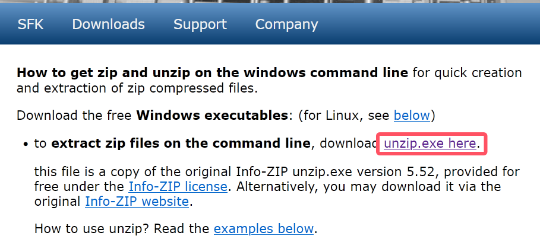
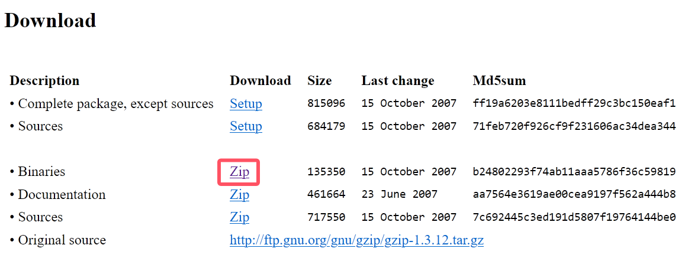
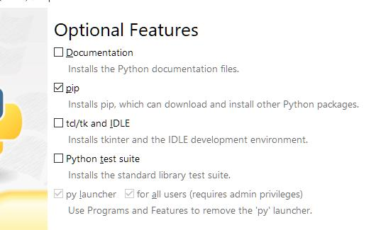
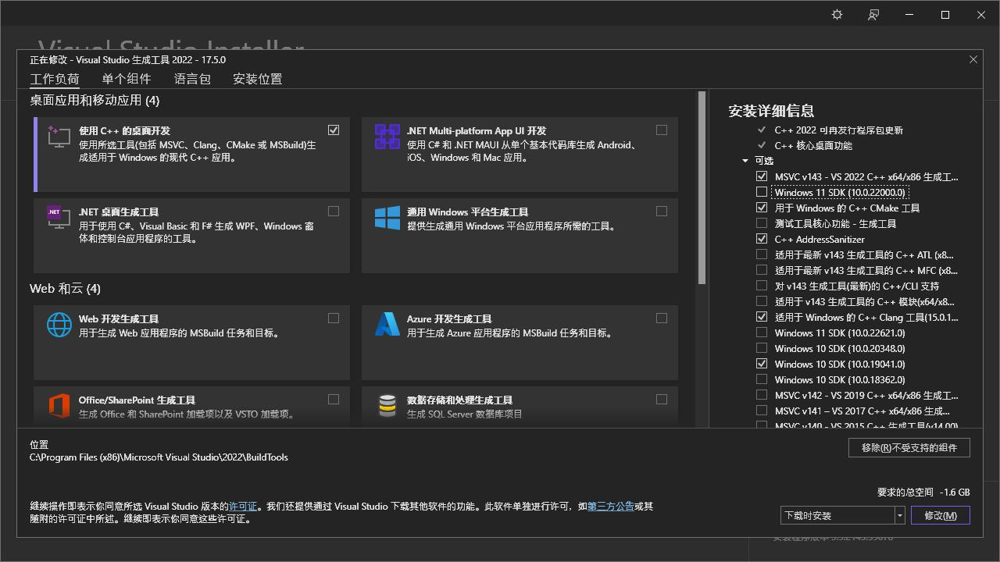
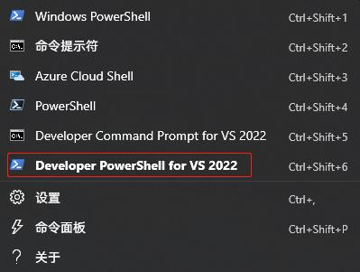

# Neovim + MSBuild 配置 Windows 开发环境

为了与 Linux 拥有一致的开发体验，特在此记录：在 Windows 上使用 Neovim + CMake + MSBuild 搭建 C/C++ 环境。

配置完成后，您将拥有以下几种开发环境：

- C/C++
- Qt/qml
- python
- nodejs
- rust

首先上效果：


> [!WARNING] 注意
> 由于 Neovim 插件和一些配置需要访问[Github](https://github.com/)，若无法访问，请自行百度`科学上网`或`DNS解析`，另不推荐使用镜像站或[Gitee](https://gitee.com/)，因为某些插件可能并没有被同步。

> 本篇文章提到`环境变量（PATH）`的设置，关于 Windows 环境变量设置，网上有很多教程，这里不再赘述。

## 系统基础环境配置

可以创建一个目录用来存放工具，并且将这个目录添加进系统环境变量：

```powershell
D:\Tools
```

微软推荐使用`PowerShell`，本篇文章基于`Windows Terminal`及`PowerShell`进行配置，请自行在微软商店或者github中安装这两款软件，即本配置不适用于`Win7`及以下版本。

### 7z

1. 下载[7-Zip](https://www.7-zip.org/)，选择`x64`版本
2. 下载完成后双击安装
3. 将安装路径添加道系统环境变量，如`C:\Program Files\7-Zip`

### unzip

1. 下载[unzip.exe](http://stahlworks.com/tool-zipunzip)
2. 下载完成后直接丢到`D:\Tools`目录
   

### gzip

1. 下载[Binaries](https://gnuwin32.sourceforge.net/packages/gzip.htm)压缩包
2. 解压后将`gzip.exe`放在`D:\Tools`目录
   

### wget

1. 下载[wget.exe](https://eternallybored.org/misc/wget/)
2. 将`wget.exe`放在`D:\Tools`目录

### tree-sitter

1. 下载[tree-sitter-windows-x64.gz](https://github.com/tree-sitter/tree-sitter/releases)，看名字下载，别下错了。
2. 解压文件将`tree-sitter.exe`文件放在`D:\Tools`目录

### ripgrep

1. 下载[ripgrep-14.1.0-x86_64-pc-windows-msvc.zip](https://github.com/BurntSushi/ripgrep/releases)
2. 解压文件将`rg.exe`文件放在`D:\Tools`目录

> [!TIP] 提示
> 版本号可能会随着官方版本迭代有变化，安装最新版本即可！
>
> 若找不到该文件，点击下方的`Show all xx assets`，展开后下载即可。

### fd

1. 下载[fd-v10.1.0-x86_64-pc-windows-msvc.zip](https://github.com/sharkdp/fd/releases)
2. 解压文件将`rg.exe`文件放在`D:\Tools`目录

> [!TIP] 提示
> 版本号可能会随着官方版本迭代有变化，安装最新版本即可！
>
> 若找不到该文件，点击下方的`Show all xx assets`，展开后下载即可。

### fzf

1. 下载[ fzf-0.63.0-windows_amd64.zip](https://github.com/junegunn/fzf/releases)
2. 解压文件将`fzf.exe`文件放在`D:\Tools`目录

> [!TIP] 提示
> 版本号可能会随着官方版本迭代有变化，安装最新版本即可！
>
> 若找不到该文件，点击下方的`Show all xx assets`，展开后下载即可。

### fnm

1. 下载[fnm-windows.zip](https://github.com/Schniz/fnm/releases)
2. 解压文件将`fnm.exe`文件放在`D:\Tools`目录

配置 fnm：

```powershell
echo "fnm env --use-on-cd | Out-String | Invoke-Expression" >> $PROFILE
```

> [!IMPORTANT] 小提示
> 若提示找不到路径，可以新建目录，再重新执行上面的命令：
>
> ```
> mkdir ~\Documents\PowerShell
> ```

重启`PowerShell`，安装 nodejs：

```powershell
fnm install --latest --node-dist-mirror=https://npmmirror.com/mirrors/node
fnm default 24
fnm use 24
```

> [!TIP] 提示
> 版本号可能会随着官方版本迭代有变化，修改为自己安装的版本即可！
>
> fnm 只是个 nodejs 的版本管理器，不喜欢可以自行以其他方式安装 nodejs！

配置 nodejs 国内源：

```powershell
npm config set registry https://registry.npmmirror.com/
```

### python

1. 下载[python](https://www.python.org/downloads/)
2. 双击 exe 文件安装

勾选 pip：


勾选所有用户：


> 建议自定义安装，注意勾选`pip`。

配置虚拟环境，在家目录执行：

```powershell
cd ~
python -m venv .venv
```

```powershell
echo "~\.venv\Scripts\Activate.ps1" >> $PROFILE
```

重启`PowerShell`，配置 pip 国内源：

```powershell
pip config set global.index-url https://pypi.tuna.tsinghua.edu.cn/simple
```

### Neovim

下载[nvim-win64.msi](https://github.com/neovim/neovim/releases/latest/download/nvim-win64.msi)后双击安装，如果需要[nightly](https://github.com/neovim/neovim/releases/download/nightly/nvim-win64.msi)版本，可点击直接下载。

### Git

查看[Git](https://git-scm.com/download/win)官方文档，点击`64-bit Git for Windows Setup`进行下载，然后安装即可

添加`PowerShell` git 支持，执行：

```powershell
Install-Module posh-git -Scope CurrentUser
```

> [!TIP] 提示
> posh-git 可能会导致 PowerShell 启动速度变慢，安装后只是会帮助 git 命令自动补全，熟悉 git 命令可以不安装，但 git 一定要安装！

### MSBuild

1. 下载[Visual Studio 2022 生成工具](https://visualstudio.microsoft.com/visual-cpp-build-tools/)
2. 双击 exe 文件进行安装
3. 在弹出的界面，左侧勾选`使用 C++ 的桌面开发`，右侧按下图勾选即可
   

安装完成后，系统开始菜单应该有`Developer PowerShell for VS 2022`，右键->打开文件位置->右键文件->属性->快捷方式，复制`目标(T):`里面的内容：

> [!TIP] 提示
> 如果已经安装了 Visual Studio，可以不必安装生成工具，直接使用即可！



```powershell
explorer.exe $PROFILE
```

打开的文件`~\Documents\PowerShell\Profile.ps1`添加刚刚复制的内容，并进行调整（删一些双引号），最终结果为：

```powershell
Import-Module "C:\Program Files (x86)\Microsoft Visual Studio\2022\BuildTools\Common7\Tools\Microsoft.VisualStudio.DevShell.dll"
Enter-VsDevShell e344e64a -DevCmdArguments '-arch=x64 -no_logo'
```

> [!TIP] 提示
> 其中`-DevCmdArguments`参数是手动添加的，目的是调整架构，为后面编译`Neovim`插件做准备。e344e64a 每次安装都不一样的，注意别直接复制！

最终的配置文件内容：

```powershell
# Install-Module posh-git -Scope CurrentUser
# 引入 git 模块，引入之前需要先执行上面的命令，若报错需要执行：set-executionpolicy remotesigne
Import-Module posh-git # 可选，会导致 PowerShell 启动速度变慢
# 添加开发环境
Import-Module "C:\Program Files (x86)\Microsoft Visual Studio\2022\BuildTools\Common7\Tools\Microsoft.VisualStudio.DevShell.dll"
Enter-VsDevShell e344e64a -DevCmdArguments '-arch=x64 -no_logo'
# 设置 Ctrl+D 退出终端
Set-PSReadLineKeyHandler -Key 'Ctrl+d' -Function DeleteCharOrExit
# 设置 fnm 环境变量
fnm env --use-on-cd | Out-String | Invoke-Expression
# 引入 python 虚拟环境
~\.venv\Scripts\Activate.ps1
```

### Rust

查看[官网](https://www.rust-lang.org/tools/install)，下载[64位程序](https://static.rust-lang.org/rustup/dist/x86_64-pc-windows-msvc/rustup-init.exe)

使用官方的源下载比较慢，可以临时设置环境变量，加速下载：

```powershell
$env:RUSTUP_DIST_SERVER="https://mirrors.tuna.tsinghua.edu.cn/rustup"
```

```powershell
~\Downloads\rustup-init.exe
```

配置`cargo`国内源，在`~\.cargo\config.toml`中添加：

```toml
[source.crates-io]
registry = "https://github.com/rust-lang/crates.io-index"
# 指定镜像
replace-with = 'rsproxy' # 如：tuna、sjtu、ustc，或者 rustcc

# 字节跳动
[source.rsproxy]
registry = "sparse+https://rsproxy.cn/index/"

# 中国科学技术大学
[source.ustc]
registry = "sparse+https://mirrors.ustc.edu.cn/crates.io-index/"

# 上海交通大学
[source.sjtu]
registry = "sparse+https://mirrors.sjtug.sjtu.edu.cn/git/crates.io-index/"

# 清华大学
[source.tuna]
registry = "sparse+https://mirrors.tuna.tsinghua.edu.cn/git/crates.io-index/"

# rustcc社区
[source.rustcc]
registry = "sparse+https://code.aliyun.com/rustcc/crates.io-index/"
```

> [!IMPORTANT] 注意
> 安装完成后，终端里面会提示添加环境变量：`%USERPROFILE%\.cargo\bin`，注意这个路径添加在用户基本的环境变量里面，而不是系统级别，也就是上面的环境变量，不是下面的！

## 开发环境配置

在配置开发环境之前，可以检查下上面的工具是否都全部安装了，环境变量是否都配置好了：

> [!WARNING] 很重要：
> 
>```powershell
>7z -h
>unzip -h
>gzip -V
>wget -V
>tree-sitter -V
>rg -V
>fd -V
>fzf --version
>fnm -V
>npm --version
>cargo -V
>pip -V
>```

如果有报错，自行百度或者检查下上面的步骤！

### Git 配置

有时配置 ssh key 之后，每次 clone pull push 的时候还是提示输入密码，可以参考[官方文档](https://docs.github.com/zh/authentication/troubleshooting-ssh/using-ssh-over-the-https-port)
添加`~/.ssh/config`文件，并且写入：

```powershell
Host github.com
Hostname ssh.github.com
Port 443
User git
```

### Neovim 配置

> [!TIP] 提示
> 作为开发者，最好有条理的管理自己的项目，本人将`D:\Projects`作为项目目录，还可以将该目录设置为启动目录。

1. Neovim 配置对于刚接触的人可能比较复杂，其实就是配置一些插件，大部分插件的 github 都有其使用说明，这里为了方便，可以直接使用本人的[配置](https://github.com/Groveer/nvvim)，执行：

```powershell
git clone git@github.com:Groveer/nvvim.git nvim
```

2. 创建软链，Neovim 读取配置是在固定的目录，在`powershell`中执行：

```powershell
New-Item -ItemType Junction -Path "~\AppData\Local\nvim" -Target "D:\Projects\nvim"
```

其中，D:\Projects\nvim`是 git clone 下来的项目

3. 本人的 Neovim 配置使用 Lazy.nvim 进行插件管理，首次启动会自动进行安装插件，若因网络问题安装失败，可以重新打开，多尝试几次：

```powershell
nvim
```

4. 一般来说，进行了上面的软件安装，Neovim 所需的程序就齐全了，当然也可以执行命令进行检查：

```powershell
:checkhealth
```

5. 第一次启动可以安装推荐 Lsp：

```powershell
:Mason
```

5. 若 Lsp 提示安装失败，可查看日志，然后根据日志内容进行修复：

```powershell
:MasonLog
```

### 扩展字体配置

1. 使用图标字体才能完全支撑某些终端图标的正常显示，否则某些字体可能会显示为方块。
2. 下载[Maple](https://github.com/subframe7536/Maple-font/releases)字体
3. 解压文件后全选 ttf 文件，然后右键安装
4. 终端：设置->默认值->字体，选择`Maple Mono NF CN`，保存弹窗提示忽略
5. 重启终端，进入 nvim，正常显示图标字体

## Qt 开发环境配置

1. 进入 Qt 在线[下载](https://download.qt.io/archive/online_installers/)页面
2. 选择最高的版本，进入目录
3. 选择`qt-online-installer-windows-x64-4.8.0.exe`进行下载（版本可能会更新，撰写本文时，官网上最新的是 4.8.0 版本，若有更新，选择最新的版本即可）
4. 为了加快安装速度，使用命令行启动安装文件，可以配置使用国内源进行安装：

```powershell
~\Downloads\qt-online-installer-windows-x64-4.8.0.exe --mirror https://mirror.nju.edu.cn/qt
```

5. 登录 Qt 账户，等待元信息检索完成。
6. 勾选展开 Qt 对应版本，勾选`MSVC 2019 64-bit`。
7. 其他默认勾选的选项可`取消勾选`，若习惯使用 qtcreator，可以将其勾选上，建议保留`CMake`&`ninja`。
8. 最后点击右下角的安装，等待安装完成。
9. 在环境变量中，`Path`变量需添加一行：`C:\Qt\6.7.1\msvc2019_64\bin`，注意需改为自己的安装路径。
10. 使用本人的 Neovim 配置已经自动支持`qml`补全和提示。

> 在配置过程中若遇到什么问题，可在博客中留言。
